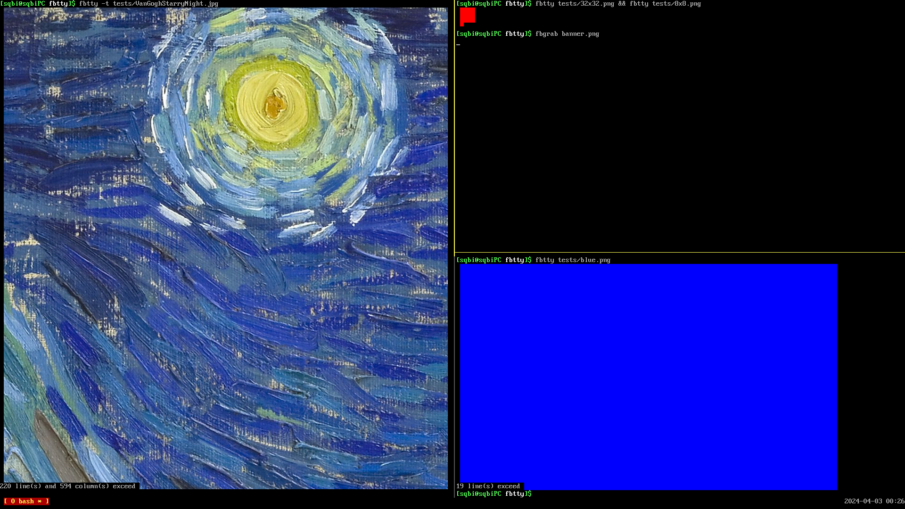

# fbtty

fbtty is a small image viewer for terminal framebuffer.
Unlike [FIM](https://nongnu.org/fbi-improved) or [fbi](https://github.com/kraxel/fbida) it doesn't use interface covering whole screen. It aims to be 
nice with terminal multiplexers.



## Requirements

- Uses file descriptors, ioctl to framebuffer, getopt - rather Linux stuff.
- It may require proper setup of /dev/fb0 permissions. See 
[Seena Burns' Devlog](https://seenaburns.com/2018/04/04/writing-to-the-framebuffer/)

## Installation

```sh
./bootstrap # calls autotools
./configure
make
make install
```

## License

fbtty's is [MIT](https://choosealicense.com/licenses/mit). Uses 
[nothings' stb\_image.h](https://github.com/nothings/stb) which is 
public domain.
